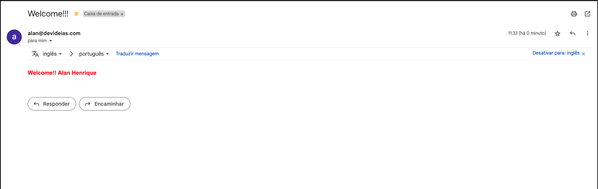

<p align="center">
  <a href="https://getpayever.com/jobs/about" target="blank"></a>
</p>

<p align="center">
    <a href="https://www.linkedin.com/in/alanhrc/" target="_blank"></a>
    <a href="https://www.facebook.com/alan.camargo.3914" target="_blank"></a>
    <a href="https://contate.me/alanhrc" target="_blank"></a>
</p>

## Description Test

### Technologies used
- Nestjs
- Prisma
- Mongodb
- RabbitMQ
- Nodemailer
- Multer
- Jest

## Installation

```bash
$ npm install
```

## Running the app

```bash
# Development local

$ cp .env.template .env # Adjust variables mongo and rabbit

$ change variable 'ENV_DOCKER' in '.env' to 'LOCAL'

$ npx prisma generate

$ npm run start:dev
```

```bash
# Development with docker compose

$ cp .env.template .env # Adjust variables mongo and rabbit

$ change variable 'ENV_DOCKER' in '.env' to 'RUNNING'

$ docker compose up --build

# Obs: Used mongo atlas cluster variable due to some tweaks in the mongo docker image (tweak needed)
```

## Test

```bash
# Unit tests
$ npm run test:watch
```

<p align="center">
  
</p>

### Contains a file `Insomnia` with routes and params project to test manually, you can import file

<p align="center">
  
</p>

## Require Features

- POST /api/users
On the request store the user entry in db. After the creation, send an email and rabbit event. Both can be dummy sending (no consumer needed).

<p align="center">
  
</p>

<p align="center">
  
</p>

### Rabbit consume
<p align="center">
  
</p>

<p align="center">
  
</p>

<p align="center">
  
</p>

</br>

- GET /api/user/{userId}
Retrieves data from https://reqres.in/api/users/{userId} and returns a user in JSON representation.

<p align="center">
  
</p>

</br>

- GET /api/user/{userId}/avatar
Retrieves image by 'avatar' URL.
On the first request it should save the image as a plain file, stored as a mongodb entry with userId and hash. Return its base64-encoded representation.
On following requests should return the previously saved file in base64-encoded. representation (retrieve from db).

<p align="center">
  
</p>

<p align="center">
  
</p>

<p align="center">
  
</p>

</br>

- DELETE /api/user/{userId}/avatar
Removes the file from the FileSystem storage.
Removes the stored entry from db.

<p align="center">
  
</p>

<p align="center">
  
</p>
